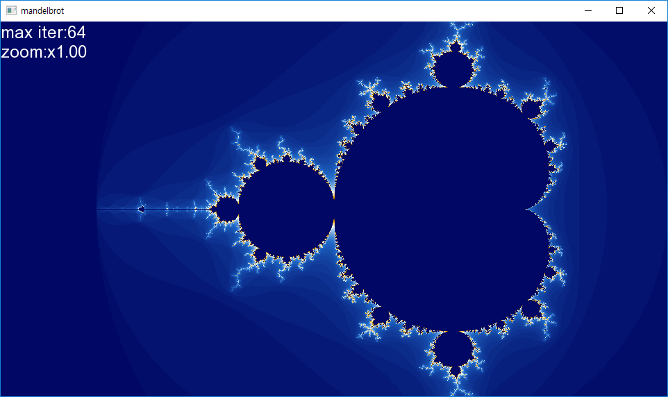
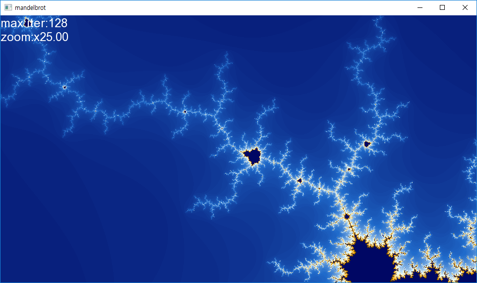
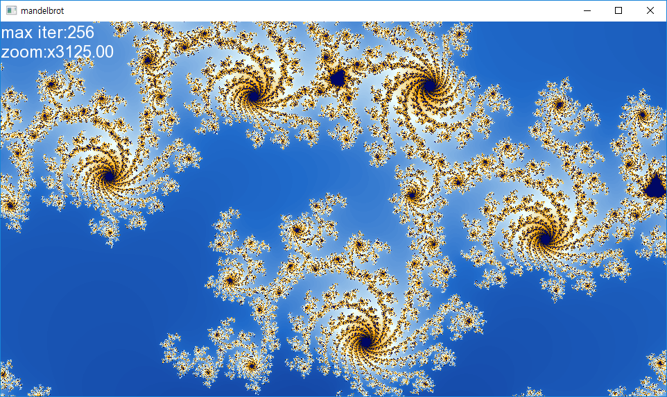

# mandelbrot plotter
Draw mandelbrot with C++11/SFML

# operation keys
up/down/left/right = move
mouse left click = zoom in
mouse right click = zoom out
mouse wheel up = more iteration (more precise result)
mouse wheel down = less iteration (less precise result)
